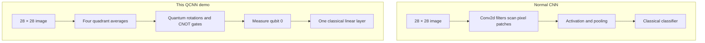
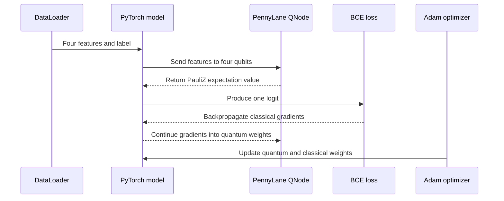

# Quantum Convolutional Neural Network for MNIST 0 vs 1

I built this small project to understand how a quantum circuit can become a
trainable part of a normal PyTorch model. The task is intentionally simple:
given a handwritten MNIST image, predict whether it is a `0` or a `1`.

This is a **hybrid quantum-classical demo**. PyTorch handles the dataset,
training loop, loss and optimizer. PennyLane provides a four-qubit quantum
circuit, and `TorchLayer` connects that circuit to PyTorch so gradients can
flow through the complete model.

> This project is meant for learning and experimentation. A normal CNN is a
> better practical choice for MNIST, and this demo does not claim quantum
> advantage.

## What is a QCNN?

A normal Convolutional Neural Network learns small filters that move across an
image. These filters detect useful patterns such as edges, curves and shapes.
Pooling then reduces the feature maps while keeping important information.

A Quantum Convolutional Neural Network follows a similar broad idea, but its
operations are quantum gates:

- image features are encoded into qubits;
- trainable quantum gates act like learnable transformations;
- CNOT gates allow qubits to influence each other;
- quantum pooling concentrates information onto fewer qubits;
- measurement converts the quantum state back into a normal number.

In this project, “convolution” does not mean sliding a quantum filter over all
784 pixels. The image is first compressed into four values, and the quantum
circuit processes those four values. This keeps the code and simulation small
enough to run on a laptop.

## Normal CNN vs this QCNN

| Part | Normal CNN | This QCNN demo |
|---|---|---|
| Input | Usually the complete `28 × 28` image | Four average-brightness values |
| Learnable operation | `Conv2d` filters | Trainable `RY` and `RZ` gates |
| Information sharing | Neighbouring image pixels | CNOT-connected qubits |
| Pooling | Max or average pooling | CNOT gates collect information on qubit 0 |
| Output | Classical feature maps | A `PauliZ` expectation value |
| Hardware | CPU or GPU | Four-qubit CPU simulator |
| Best use here | Accurate image classification | Learning quantum–PyTorch integration |



## Why use a QCNN at all?

MNIST does not *need* a quantum model. A small classical CNN can normally solve
this problem faster and more accurately. The value of this project is that it
answers practical beginner questions:

- How do I convert normal image data into inputs for qubits?
- How do I make quantum gates trainable?
- Can a PennyLane circuit behave like a PyTorch `nn.Module`?
- Can `loss.backward()` send gradients through a quantum circuit?
- How can quantum and classical layers be trained with the same optimizer?

These ideas are useful before moving to larger circuits, different datasets or
real quantum backends. The project is a bridge between basic PyTorch knowledge
and hands-on quantum machine learning.

## Complete project flow

```mermaid
flowchart LR
    A["MNIST image<br/>28 × 28 pixels"] --> B["Keep only<br/>digits 0 and 1"]
    B --> C["Split image into<br/>four quadrants"]
    C --> D["Average brightness<br/>x₀, x₁, x₂, x₃"]
    D --> E["RY encoding<br/>one value per qubit"]
    E --> F["Trainable<br/>RY and RZ gates"]
    F --> G["CNOT chain<br/>shares information"]
    G --> H["Quantum pooling<br/>onto qubit 0"]
    H --> I["PauliZ<br/>measurement"]
    I --> J["Linear layer<br/>one logit"]
    J --> K["Sigmoid<br/>digit 0 or 1"]
```



Here is the same flow in plain language:

1. TorchVision loads the included MNIST train and test splits.
2. Only images labelled `0` or `1` are kept.
3. Each image is divided into top-left, top-right, bottom-left and bottom-right
   quadrants.
4. The average brightness of every quadrant becomes one input feature.
5. Four `RY` gates encode those four features onto four qubits.
6. Trainable `RY` and `RZ` gates change during training.
7. CNOT gates connect neighbouring qubits.
8. More CNOT gates pool the information onto qubit 0.
9. Measuring `PauliZ(0)` returns one value between `-1` and `1`.
10. A classical linear layer converts that value into a binary-classification
    logit.
11. `BCEWithLogitsLoss` calculates the error, and Adam updates both the quantum
    and classical parameters.

The complete model has only **10 trainable values**: eight quantum rotation
angles plus the weight and bias of the final linear layer.

## How quantum gradients reach PyTorch

The QNode uses `interface="torch"` and is wrapped inside PennyLane's
`TorchLayer`. Because of this connection, the quantum layer participates in
the same forward and backward passes as an ordinary neural-network layer.



## Project structure

```text
project/
├── data.py                 MNIST filtering and four-feature extraction
├── quantum_layer.py        Four-qubit circuit, pooling and TorchLayer
├── model.py                Quantum layer plus classical output layer
├── train.py                Training, testing, CLI, CSV and model saving
├── train_qcnn.py           Simple one-command entry point
├── requirements.txt        Exact Python package versions
├── tests/
│   ├── test_cli.py         Checks command-line settings
│   ├── test_data.py        Checks preprocessing and label filtering
│   └── test_model.py       Checks model output and quantum gradients
├── data/                   Included raw MNIST train and test files
└── results/
    ├── training_log.csv    Loss and accuracy for every epoch
    └── qcnn_model.pt       Saved trained weights
```

## Setup and installation

The project was verified with Python `3.13.11`. It runs entirely on a CPU and
does not require a GPU, quantum-computing account or cloud API key.

### 1. Open the project folder

```bash
cd project
```

### 2. Create a virtual environment

macOS or Linux:

```bash
python3 -m venv venv
source venv/bin/activate
```

Windows PowerShell:

```powershell
py -m venv venv
venv\Scripts\Activate.ps1
```

### 3. Install the packages

```bash
python -m pip install --upgrade pip
python -m pip install -r requirements.txt
```

The main packages are:

- **PyTorch** for the model, optimizer and training loop;
- **TorchVision** for loading MNIST and downloading it again if needed;
- **PennyLane** for the quantum circuit and PyTorch integration;
- **pytest** for the automated checks.

## Run the project

### Recommended experiment

This command uses 2,000 unique binary MNIST training images, ten epochs and a
learning rate of `0.10`:

```bash
python train_qcnn.py --train-size 2000 --epochs 10 --learning-rate 0.10 --no-download
```

The repository already contains the raw MNIST train and test files in `data/`,
so `--no-download` runs without making a network request. The included dataset
contains all MNIST digits; `data.py` keeps only digits `0` and `1` when the
program starts.

If the `data/` folder is removed, leave out `--no-download` and TorchVision will
download MNIST again:

```bash
python train_qcnn.py --train-size 2000 --epochs 10 --learning-rate 0.10
```

The terminal explains what is happening:

```text
Step 1/4: Preparing the MNIST data...
Step 2/4: Creating the quantum-classical model...
Step 3/4: Starting training...
Epoch 1/10: training the model...
Step 4/4: Training is complete. Saving the results...
```

### Quick smoke test

Use this when you only want to confirm that the setup works:

```bash
python train_qcnn.py --train-size 64 --test-size 64 --epochs 1
```

The accuracy from 64 images is not meaningful. This command only checks that
data loading, the quantum circuit, backpropagation and file saving work.

### Default run

Running without options uses the defaults stored in `train.py`: 2,000 training
images, five epochs, batch size 128, learning rate `0.30` and seed `42`.

```bash
python train_qcnn.py
```

See every available option with:

```bash
python train_qcnn.py --help
```

## Output files

After training, the program creates:

- `results/training_log.csv` — loss and accuracy for each completed epoch;
- `results/qcnn_model.pt` — the trained PyTorch model weights.

Running another experiment with the default paths replaces these two files.
Use `--log-csv` and `--model-path` if you want to preserve several runs.

Example:

```bash
python train_qcnn.py \
  --train-size 1000 \
  --epochs 5 \
  --log-csv results/run_1000.csv \
  --model-path results/run_1000.pt
```

## Run the automated checks

```bash
python -m pytest -q
```

The tests use tiny in-memory tensors, so they do not download MNIST or train
for several epochs. They check:

- quadrant feature extraction;
- filtering out digits other than `0` and `1`;
- beginner-friendly CLI defaults;
- model output shape and finite values;
- gradient flow into the quantum parameters.

The current code passes all **6 tests**.

## Current verified result

The latest saved model was trained with:

- seed: `42`;
- training images: `2,000` unique images;
- training balance: 903 zeros and 1,097 ones;
- test images: all 2,115 binary MNIST test images;
- epochs: `10`;
- batch size: `128`;
- learning rate: `0.10`.

It reached:

| Metric | Result |
|---|---:|
| Training accuracy | 79.5% |
| Overall test accuracy | **81.23%** |
| Accuracy on digit `0` | 76.73% |
| Accuracy on digit `1` | 85.11% |

Results can vary when the seed, subset, circuit or hyperparameters change. The
epoch-by-epoch values from this exact run are in `results/training_log.csv`.

## Final note

The main success of this project is not beating a classical CNN. It is showing,
in a small and readable codebase, that a quantum circuit can sit inside a
PyTorch model, receive gradients and train using the same tools as an ordinary
neural-network layer. That was the part I wanted to understand by building it.
